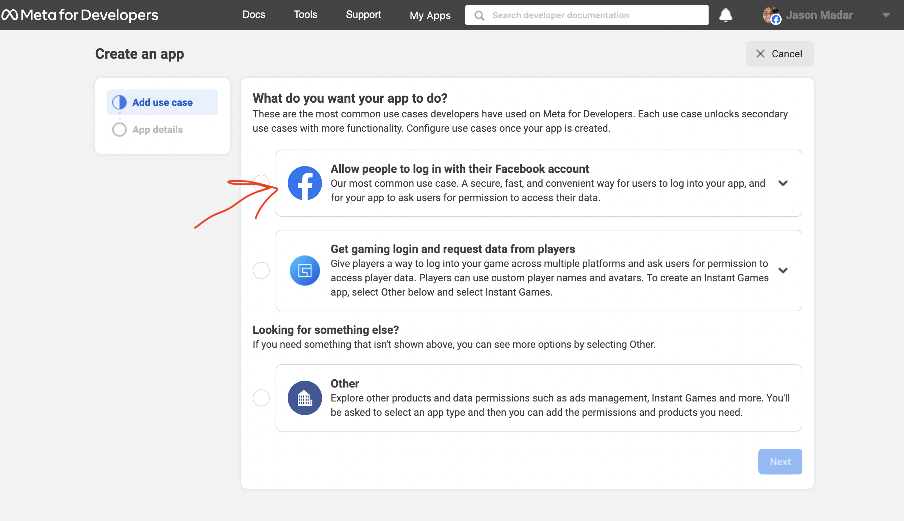
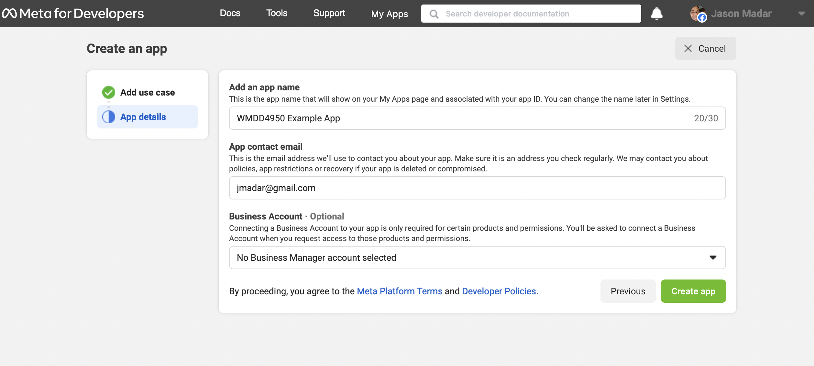
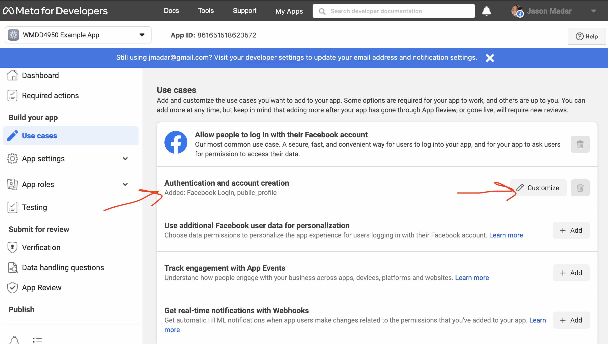
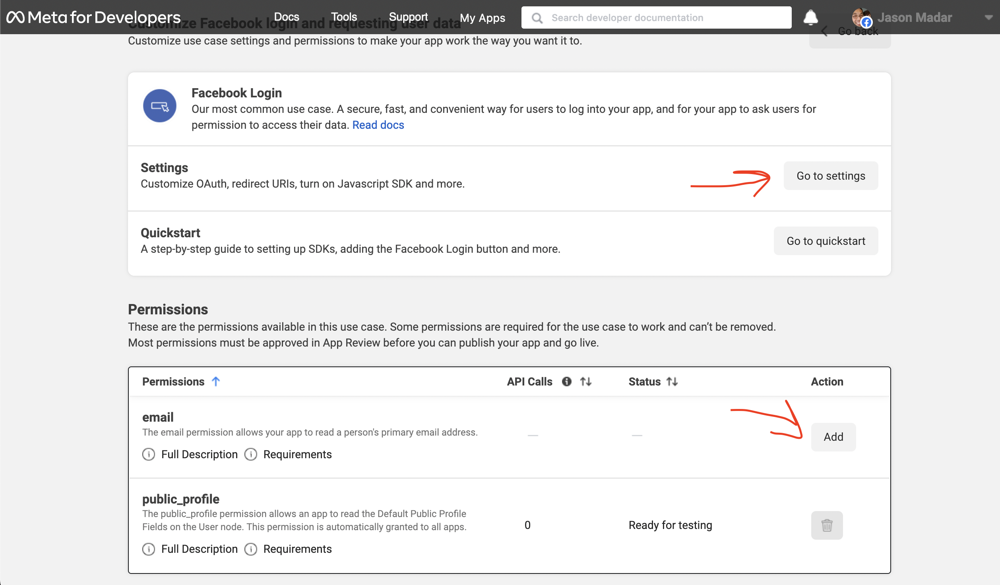
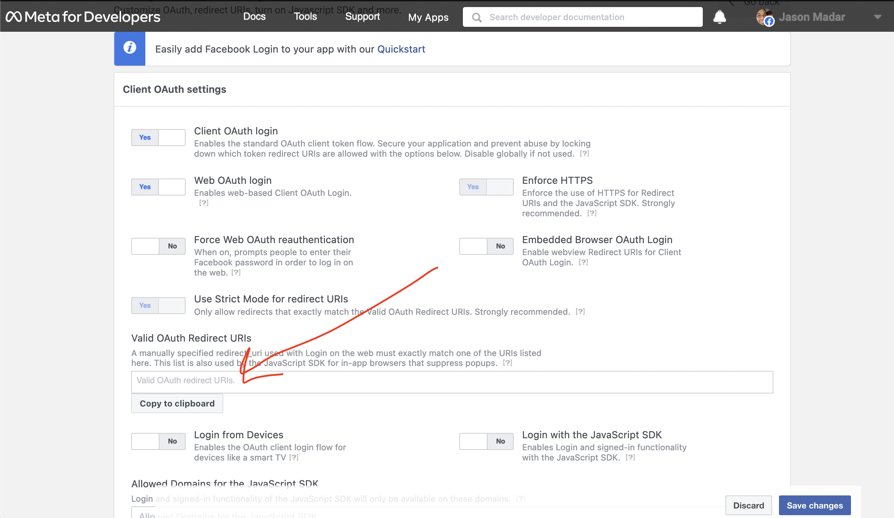
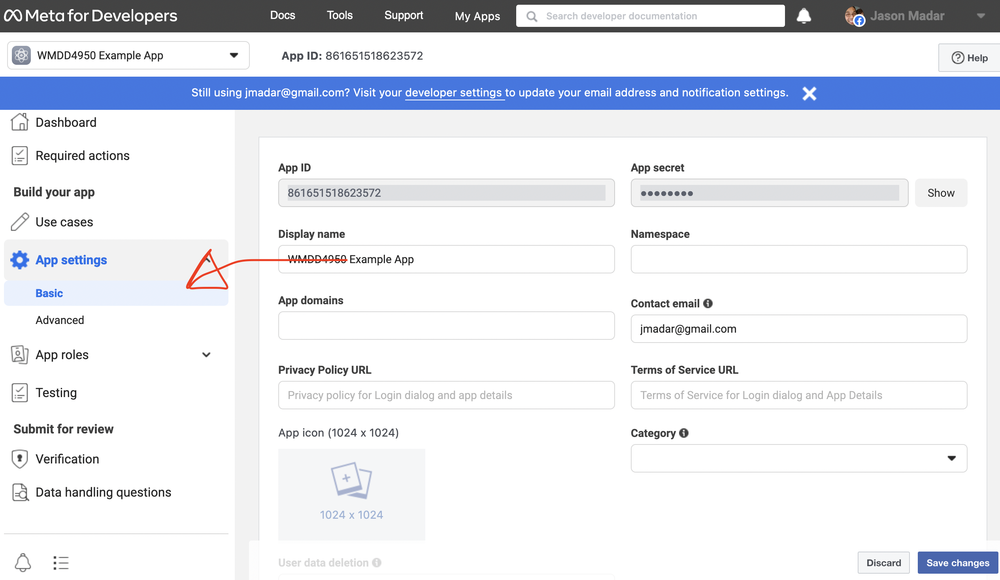

# Very basic oauth tutorial

The index.html file is well commented, so you should be able to get all the
informaiton from there.  We will be following the "Implicit" flow, which
means only one round-trip to the facebook server.

You can host this index.html file under and web server as a static file.

This is implemented without the use of SDK, and follows the steps at
[https://developers.facebook.com/docs/facebook-login/manually-build-a-login-flow/](https://developers.facebook.com/docs/facebook-login/manually-build-a-login-flow/)

To test this yourself, you will need to:

 1. Create facebook developer account
 1. Create an "App" within the developer account
 1. Pick the "Facebook Login" use case
 1. Fill in all the necessary fields

If you want to make your app public with a "Login with Facebook" button, you will
need to verify your business with Facebook.

# Create Developer Account

Visit [https://developer.facebook.com/](https://developer.facebook.com/) to create a
developer account, the go to the app dashboard and click "Create App".

# Create App

Under create app, make sure you select the "Login with Facebook" use case.

Then, fill in the app name - you can pick your own.

# App Setup

You will now be taken to your newly created app.  Under "Build your app", select
use cases, then click on "Authentication and account creation".

Then click on Settings to access the OAuth settings.

You may also want to click on the add email permissions if you want to receive
the user's email.

# Redirect URI

The most important field is the "redirect_uri", which is your app's URL.  This will
allow users to go back to your app after logging in via Facebook.

Click on the "save changes" button.

# App settings

Navigate back to the app page, and this time select "App settings" -> Basic.  Make
note of the "App ID".  You will also need to fill our the various fields such as
"Privacy Policy URL" and "Terms of Service URL".  You can simply use your app's
URL for that.

# Modify you app code

With your own "app id" and "redirect uri", you are now ready to modify your code.  Note
that only you can login to your page as the app is in "Testing" mode.  Facebook now requires
business verification to launch this app to the public.

